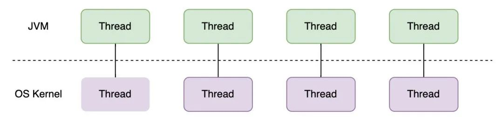
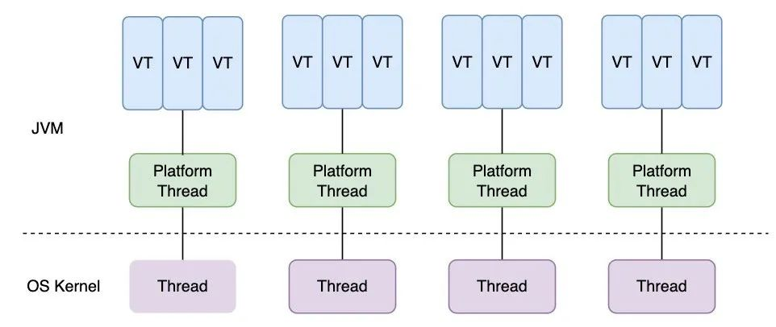

### 概述
- JDK21已于2023年9月19日发布，作为Oracle标准Java实现的一个LTS版本发布，发布了15想新特性，其中虚拟线程呼声较高。
- 虚拟线程是JDK 21中引入的一项重要特性，它是一种轻量级的线程实现，旨在提高Java应用程序的并发性能。

### 工作原理
- 虚拟线程（Virtual Threads）也被称为纤程（Fibers），其基本的工作原理是将线程的调度从操作系统级别转移到用户级别，即由JVM控制。
- 在传统的线程模型中，每个线程都对应一个操作系统级别的线程，这种线程的创建、切换和销毁等操作都需要系统调用，消耗较大。而且，每个线程都需要一个完整的线程栈，这限制了同时运行的线程数量。
- 相比之下，虚拟线程并不直接对应一个操作系统级别的线程，而是由JVM管理和调度。多个虚拟线程可能共享一个操作系统级别的线程。这样，当一个虚拟线程阻塞时，JVM可以立即切换到另一个虚拟线程，而无需等待操作系统的调度。而且，虚拟线程不需要一个完整的线程栈，所以可以创建大量的虚拟线程。
- JDK 的虚拟线程调度器是一个以`FIFO`模式运行的`ForkJoinPool`，调度器可以通过设置启动参数调整，代码如下：
```java
private static ForkJoinPool createDefaultScheduler() {
    ForkJoinWorkerThreadFactory factory = pool -> {
        PrivilegedAction<ForkJoinWorkerThread> pa = () -> new CarrierThread(pool);
        return AccessController.doPrivileged(pa);
    };
    PrivilegedAction<ForkJoinPool> pa = () -> {
        int parallelism, maxPoolSize, minRunnable;
        String parallelismValue = System.getProperty("jdk.virtualThreadScheduler.parallelism");
        String maxPoolSizeValue = System.getProperty("jdk.virtualThreadScheduler.maxPoolSize");
        String minRunnableValue = System.getProperty("jdk.virtualThreadScheduler.minRunnable");
        ... //省略赋值操作
        Thread.UncaughtExceptionHandler handler = (t, e) -> { };
        boolean asyncMode = true; // FIFO
        return new ForkJoinPool(parallelism, factory, handler, asyncMode,
                     0, maxPoolSize, minRunnable, pool -> true, 30, SECONDS);
    };
    return AccessController.doPrivileged(pa);
}
```
- 调度器分配给虚拟线程的平台线程称为虚拟线程的载体线程（carrier）。虚拟线程可以在其生命周期内会被安排在不同的载体线程上。
- 传统线程池与`OS Thread`的关系：
  
- 虚拟线程`VirtualThread`与`Platform Thread`, `OS Thread`的关系：
  
- 虚拟线程在执行到`IO`操作或`Blocking`操作时，会自动切换到其他虚拟线程执行，从而避免当前线程等待，可以高效通过少数线程去调度大量虚拟线程，最大化提升线程的执行效率。

### 如何创建虚拟线程
- 通过`Thread.startVirtualThread()`创建
```java
//创建一个新的并且已启动的虚拟线程
Thread thread = Thread.startVirtualThread(runnable);
```
- 通过`Thread.ofVirtual()`创建
```java
// 创建一个新的并且已启动的虚拟线程
Thread thread = Thread.ofVirtual().start(runnable);
```
- 通过`ThreadFactory`创建
```java
// 获取线程工厂类
ThreadFactory factory = Thread.ofVirtual().factory();
// 创建虚拟线程
Thread thread = factory.newThread(runnable);
// 启动线程
thread.start();
```
- 通过`Executors.newVirtualThreadPerTaskExecutor()`创建
```java
//创建executor
ExecutorService executor = Executors.newVirtualThreadPerTaskExecutor();
//通过executor提交任务，采用虚拟线程执行
executor.submit(runnable);
```

### 虚拟线程的状态和转换

| 状态                    | 转换说明                                     |
|-----------------------|------------------------------------------|
| NEW -> STARTED        | Thread.start                             |
| STARTED -> TERMINATED | 	failed to start                         |
| STARTED -> RUNNING    | first run                                |
| RUNNING -> PARKING    | 	Thread attempts to park                 |
| PARKING -> PARKED     | 	cont.yield successful, thread is parked |
| PARKING -> PINNED     | 	cont.yield failed, thread is pinned     |
| PARKED -> RUNNABLE    | 	unpark or interrupted                   |
| PINNED -> RUNNABLE    | 	unpark or interrupted                   |
| RUNNABLE -> RUNNING   | 	continue execution                      |
| RUNNING -> YIELDING   | 	Thread.yield                            |
| YIELDING -> RUNNABLE  | 	yield successful                        |
| YIELDING -> RUNNING   | 	yield failed                            |
| RUNNING -> TERMINATED | 	done                                    |


### 虚拟线程最佳实践
>以下说明都是基于JDK21环境示例，如果是JDK19，则需要开启预览配置`--enable-preview`
- 示例源码参考：[virtualthread-sample](https://github.com/guanyang/spring-project-samples/tree/main/virtualthread-sample)
- 在`SpringBoot`中使用虚拟线程处理请求
```java
@EnableAsync
@Configuration
@ConditionalOnProperty(value = "spring.executor", havingValue = "virtual")
public class ThreadConfig {

    //为每个异步任务提供虚拟线程执行Executor
    @Bean
    public AsyncTaskExecutor applicationTaskExecutor() {
        return new TaskExecutorAdapter(Executors.newVirtualThreadPerTaskExecutor());
    }

    //为tomcat提供虚拟线程执行Executor
    @Bean
    public TomcatProtocolHandlerCustomizer<?> protocolHandlerVirtualThreadExecutorCustomizer() {
        return protocolHandler -> {
            protocolHandler.setExecutor(Executors.newVirtualThreadPerTaskExecutor());
        };
    }

}
```

- 在`application.yml`中添加配置来启用虚拟线程
```yml
spring:
  #配置virtual表示启用虚拟线程，非virtual表示不启用，可以通过环境变量SPRING_EXECUTOR指定
  executor: ${SPRING_EXECUTOR:virtual}
```

- 添加测试入口进行虚拟线程测试
```java
@RestController
@SpringBootApplication
public class VirtualthreadSampleApplication {

    public static void main(String[] args) {
        SpringApplication.run(VirtualthreadSampleApplication.class, args);
    }

    @GetMapping("/hello/{timeMillis}")
    public Object hello2(@PathVariable long timeMillis) throws InterruptedException {
        Map<String, Object> map = new HashMap<>();
        map.put("time", System.currentTimeMillis());
        map.put("msg", "Hello World!");
        //查看当时线程信息，识别是否是虚拟线程
        map.put("thread", Thread.currentThread().toString());
        //模拟耗时IO操作
        Thread.sleep(timeMillis);
        return map;
    }

}
```

### 性能测试

#### 资源版本
- Spring Boot: 3.1.4
- JDK: graalvm-jdk-21
- Docker Engine: 24.0.5
- Docker Resource: 4C/8G

#### 压测源码&镜像
- 压测源码：https://github.com/guanyang/spring-project-samples/tree/main/virtualthread-sample
- 镜像资源
    - Dockerfile: virtualthread-sample/src/main/docker/Dockerfile
    - 已构建示例镜像: guanyangsunlight/spring-project-samples:virtualthread-sample-0.0.1-SNAPSHOT
- JMH测试代码: virtualthread-sample/src/test/java/org/gy/demo/virtualthread/ThreadTest.java
- http测试接口：${host}/hello/{timeMillis}, host为服务地址，timeMillis为模拟IO操作的时间，单位毫秒，响应示例如下：
```json
{
    msg: "Hello World!",
    time: 1695871679753,
    thread: "VirtualThread[#59]/runnable@ForkJoinPool-1-worker-1"
}
```

#### 压测工具
- K6: 压测http请求，参考链接：[https://k6.io/docs/](https://k6.io/docs/)
- JMH: 由`OpenJDK`团队开发的一款基准测试工具，参考链接：[https://github.com/openjdk/jmh](https://github.com/openjdk/jmh)

#### 压测场景case
- 【基于K6】Spring Boot虚拟线程: 性能指标（QPS、Avg Latency、P95）
- 【基于K6】Spring Boot普通线程: 性能指标（QPS、Avg Latency、P95）
- 【基于JMH】普通线程任务调度执行: 平均响应时间（AverageTime）
- 【基于JMH】虚拟线程任务调度执行: 平均响应时间（AverageTime）

#### K6压测

##### 压测脚本
- 总请求时长60s，并发从200开始，并按照200步长增长，命令如下：
```
k6 run -u 200 --duration 60s -e url=http://127.0.0.1:8081/hello/100 simple-test.js

-i：指定请求数量
-u：模拟并发数量
--duration：请求时长定义，例如：60s，1m
-e url：指定环境变量url，用于实际场景替换
```
##### `simple-test.js`脚本说明
```
import http from 'k6/http';
import { check } from 'k6';

export default function () {
  const res = http.get(`${__ENV.url}`);
  check(res, {
    'is status 200': (r) => r.status === 200
  });
}
```

##### 压测docker实例
```shell
## 启用虚拟线程实例
docker run --name virtualthread-sample-vt -p 8081:8080 -e SPRING_EXECUTOR=virtual -d guanyangsunlight/spring-project-samples:virtualthread-sample-0.0.1-SNAPSHOT

## 启用普通线程实例
docker run --name virtualthread-sample -p 8082:8080 -e SPRING_EXECUTOR=none -d guanyangsunlight/spring-project-samples:virtualthread-sample-0.0.1-SNAPSHOT
```

##### K6压测结果

| Case                    | QPS           | Avg Latency | P95      |
|-------------------------|---------------|-------------|----------|
| Spring Boot虚拟线程,-u 200  | 1620.869685/s | 123.09ms    | 149.42ms |
| Spring Boot虚拟线程,-u 400  | 2202.121674/s | 180.84ms    | 277.14ms |
| Spring Boot虚拟线程,-u 600  | 3195.845398/s | 186.44ms    | 256.03ms |
| Spring Boot虚拟线程,-u 800  | 3780.654388/s | 210.28ms    | 294.79ms |
| Spring Boot虚拟线程,-u 1000 | 4250.384928/s | 234.17ms    | 319.92ms |
| Spring Boot虚拟线程,-u 1200 | 4479.450088/s | 266.15ms    | 370.17ms |
| Spring Boot普通线程,-u 200  | 1418.709029/s | 140.69ms    | 218.24ms |
| Spring Boot普通线程,-u 400  | 1888.860872/s | 210.91ms    | 247.39ms |
| Spring Boot普通线程,-u 600  | 1889.607486/s | 315.49ms    | 373.9ms  |
| Spring Boot普通线程,-u 800  | 1954.985051/s | 405.99ms    | 428.44ms |
| Spring Boot普通线程,-u 1000 | 1917.568269/s | 516.33ms    | 585.76ms |

##### K6压测总结
>以上实例都是在jvm默认参数及tomcat线程池默认200大小场景下进行，没有进行任何调优配置
- 采用虚拟线程模式，随着并发数的提高，性能提升比较明显，整体性能明显优于普通线程模式。
- 采用普通线程模式，由于tomcat默认线程池配置，增加并发数并不能明显提升QPS，由于阻塞等待导致耗时边长。
- 虚拟线程在执行到`IO`操作或`Blocking`操作时，会自动切换到其他虚拟线程执行，从而避免当前线程等待，可以高效通过少数线程去调度大量虚拟线程，最大化提升线程的执行效率。

#### 基于JMH任务调度测试
##### 基础配置说明
```java
@BenchmarkMode({Mode.AverageTime})      //平均响应时间模式
@OutputTimeUnit(TimeUnit.MILLISECONDS)  //输出单位：毫秒模式
@State(Scope.Benchmark)                 //作用域为本次JMH测试，线程共享
@Fork(value = 1)                        //fork出一个JVM进程
@Threads(4)                             //使用4个线程去执行测试方法
@Warmup(iterations = 5, time = 1, timeUnit = TimeUnit.SECONDS)   //预热迭代5次，每次一秒
@Measurement(iterations = 5, time = 1, timeUnit = TimeUnit.SECONDS)   //测试迭代5次，每次一秒
public class ThreadTest {

    @Param({"500", "1000", "2000"})     //模拟任务调度次数，分别500次，1000次，2000次
    private int loop;

    @Param({"50", "100", "200"})        //模拟线程池大小，也是虚拟线程调度器大小
    private int nThreads;
    
    private ExecutorService executor;
    private ExecutorService virtualExecutor;
    
    @Setup      //每个测试方法前初始化
    public void setup() {
        //普通线程方式
        executor = Executors.newFixedThreadPool(nThreads);

        //定义虚拟线程调度器大小，保持跟平台线程池大小一样
        System.setProperty("jdk.virtualThreadScheduler.maxPoolSize", String.valueOf(nThreads));
        virtualExecutor = Executors.newVirtualThreadPerTaskExecutor();
    }

    @TearDown       //每个测试方法执行后销毁
    public void tearDown() {
        executor.close();
        virtualExecutor.close();
    }
    
    //主函数启动测试
    public static void main(String[] args) throws RunnerException {
        Options opt = new OptionsBuilder().include(ThreadTest.class.getSimpleName()).build();
        new Runner(opt).run();
    }
    
    //普通线程测试用例
    @Benchmark
    public void platformThreadTest(Blackhole bh) {
        //模拟多个任务调度测试，返回最终结果
        List<Integer> result = execute(loop, executor, ThreadTest::sleepTime);
        bh.consume(result);
    }

    //虚拟线程测试用例
    @Benchmark
    public void virtualThreadTest(Blackhole bh) {
        //模拟多个任务调度测试，返回最终结果
        List<Integer> result = execute(loop, virtualExecutor, ThreadTest::sleepTime);
        bh.consume(result);
    }
    
    //模拟多个任务调度测试，返回最终结果
    private static <T> List<T> execute(int loop, ExecutorService executor, Supplier<T> supplier) {
        CompletableFuture<T>[] futures = new CompletableFuture[loop];
        for (int i = 0; i < loop; i++) {
            //模拟执行耗时任务
            futures[i] = CompletableFuture.supplyAsync(supplier, executor);
        }
        CompletableFuture<Void> result = CompletableFuture.allOf(futures);
        result.join();
        return Stream.of(futures).map(f -> f.getNow(null)).filter(Objects::nonNull).collect(Collectors.toList());
    }

    //sleep方法，模拟耗时IO操作，目前暂定30ms
    @SneakyThrows
    private static int sleepTime() {
        Thread.sleep(Duration.ofMillis(sleepTimeMillis));
        return sleepTimeMillis;
    }
    
    ...
}
```

##### JMH测试结果
>Score表示平均响应时间(ms)，越小越好，loop表示任务次数，nThreads表示线程数，也是虚拟线程调度器大小
```
Benchmark                      (loop)  (nThreads)  Mode  Cnt     Score      Error  Units
ThreadTest.platformThreadTest     500          50  avgt    5  1090.077 ±  324.304  ms/op
ThreadTest.platformThreadTest     500         100  avgt    5   568.331 ±  106.303  ms/op
ThreadTest.platformThreadTest     500         200  avgt    5   294.539 ±   17.419  ms/op
ThreadTest.platformThreadTest    1000          50  avgt    5  2118.651 ±  426.003  ms/op
ThreadTest.platformThreadTest    1000         100  avgt    5   923.840 ±  226.815  ms/op
ThreadTest.platformThreadTest    1000         200  avgt    5   534.198 ±  115.960  ms/op
ThreadTest.platformThreadTest    2000          50  avgt    5  4013.412 ± 2046.025  ms/op
ThreadTest.platformThreadTest    2000         100  avgt    5  1828.609 ±  413.867  ms/op
ThreadTest.platformThreadTest    2000         200  avgt    5   938.532 ±  173.568  ms/op
ThreadTest.virtualThreadTest      500          50  avgt    5    31.733 ±    0.380  ms/op
ThreadTest.virtualThreadTest      500         100  avgt    5    31.747 ±    0.468  ms/op
ThreadTest.virtualThreadTest      500         200  avgt    5    31.771 ±    0.236  ms/op
ThreadTest.virtualThreadTest     1000          50  avgt    5    32.783 ±    1.654  ms/op
ThreadTest.virtualThreadTest     1000         100  avgt    5    32.827 ±    0.959  ms/op
ThreadTest.virtualThreadTest     1000         200  avgt    5    32.672 ±    0.894  ms/op
ThreadTest.virtualThreadTest     2000          50  avgt    5    34.578 ±    1.554  ms/op
ThreadTest.virtualThreadTest     2000         100  avgt    5    35.001 ±    1.889  ms/op
ThreadTest.virtualThreadTest     2000         200  avgt    5    35.236 ±    1.127  ms/op
```

##### JMH测试总结
- 虚拟线程在执行到`IO`操作或`Blocking`操作时性能提升十分明显，有数量级的提升，非常适合`IO`密集型的场景。

### 总结
虚拟线程是Java为了解决并发编程中的一些常见问题而引入的新特性，特别是在I/O操作方面。以下是虚拟线程优缺点及使用场景总结：
- 优点：
    - **资源使用低**：虚拟线程比传统线程消耗更少的资源。
    - **简化并发编程**：虚拟线程允许直接为每一个任务创建一个线程，而不需要复杂的线程池或者任务调度策略。
    - **提高吞吐量和响应时间**：由于虚拟线程可以快速切换，所以它们可以帮助减小延迟并提高系统的吞吐量。
- 缺点：
    - **仍处于试水阶段**：虚拟线程属于新特性，生产环境暂无应用验证，处于试水阶段。
    - **与现有代码的兼容性问题**：一些依赖于线程本地存储（Thread Local Storage, TLS）或者同步原语的既有代码可能无法正确地在虚拟线程上运行。
    - **调试和监控工具支持**：当前，许多Java的调试和监控工具还不完全支持虚拟线程。
- 使用场景：
    - **高并发应用**：例如Web服务器、消息队列等，可以为每个请求或任务启动一个单独的虚拟线程，以提高系统的吞吐量。
    - **异步编程**：虚拟线程可以简化异步编程模型，使得你可以写出看起来像同步代码的异步代码。
    - **微服务架构**：在微服务架构中，通常需要处理大量的网络请求，虚拟线程可以帮助提高系统的响应能力。

> 还需要注意的是，虽然虚拟线程对于某些场景非常有用，但并不是所有问题都适合使用虚拟线程来解决。你应该根据项目的具体需求和环境选择最合适的工具。