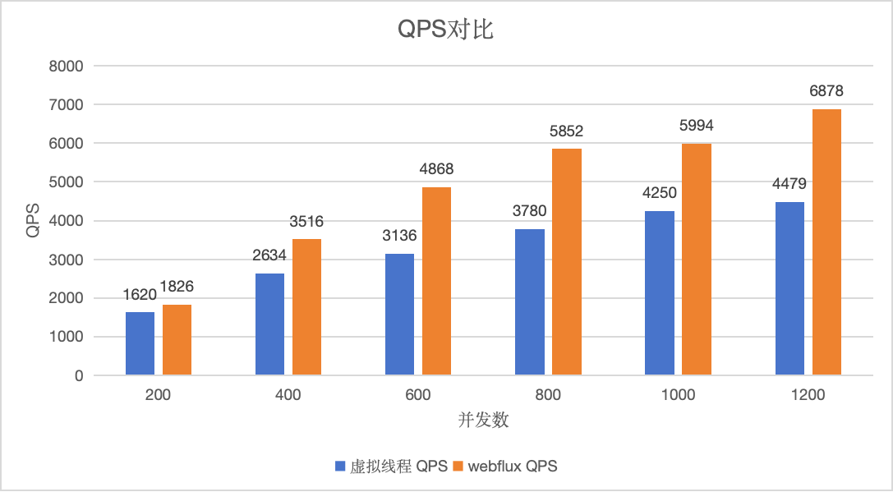
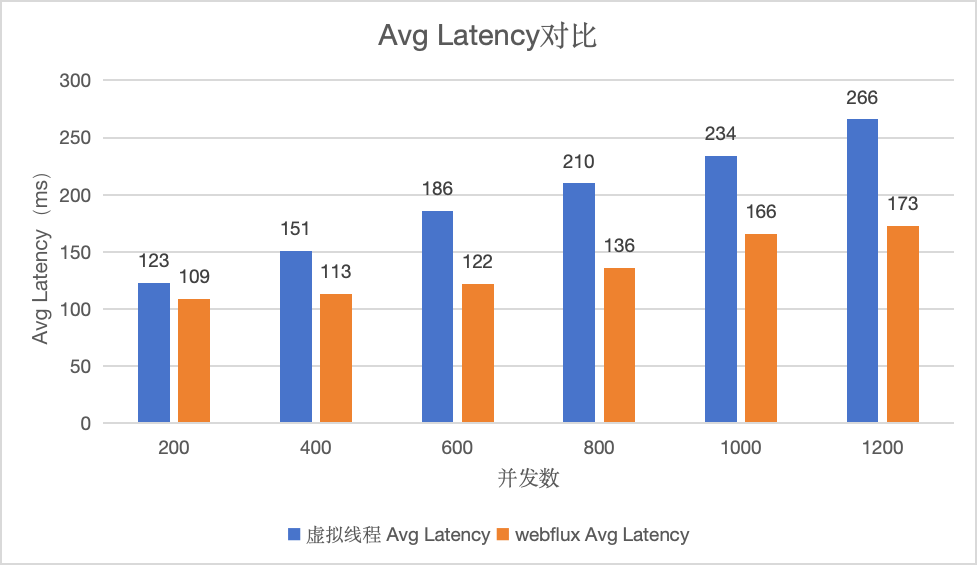

### 概述
- 虚拟线程是JDK 21中引入的一项重要特性，它是一种轻量级的线程实现，旨在提高Java应用程序的并发性能。
- 虚拟线程（Virtual Threads）也被称为纤程（Fibers），其基本的工作原理是将线程的调度从操作系统级别转移到用户级别，即由JVM控制。
- Spring WebFlux是Spring Framework的一个模块，它提供了一种基于响应式编程模型的Web开发框架。
- Spring WebFlux支持两种编程模型，分别是注解驱动和函数式编程。在注解驱动模型中，可以使用类似于Spring MVC的注解来定义请求处理方法，并利用Reactor提供的操作符和流式处理方式来处理请求和响应。在函数式编程模型中，可以使用一组函数式接口来定义路由和处理函数，以及利用Flux和Mono来处理异步数据流。

### 虚拟线程和webflux的性能对决

#### 环境及配置
- Spring Boot: 3.1.4
- JDK: graalvm-jdk-21
- Docker Engine: 24.0.5
- Docker Resource: 4C/8G

#### 压测源码&镜像
- 源码仓库：https://github.com/guanyang/spring-project-samples
- 虚拟线程源码示例：virtualthread-sample
- webflux源码示例：webflux-sample
- 已构建示例镜像如下：
```
1.虚拟线程镜像: guanyangsunlight/spring-project-samples:virtualthread-sample-0.0.1-SNAPSHOT
2.webflux镜像：guanyangsunlight/spring-project-samples:webflux-sample-0.0.1-SNAPSHOT
```
- http测试接口：${host}/hello/{timeMillis}, host为服务地址，timeMillis为模拟IO操作的时间，单位毫秒，响应示例如下：
```json
{
    msg: "Hello World!",
    time: 1695871679753,
    thread: "VirtualThread[#59]/runnable@ForkJoinPool-1-worker-1"
}
```

#### 压测工具
- K6: 压测http请求，参考链接：[https://k6.io/docs/](https://k6.io/docs/)

#### 压测场景case
- Spring Boot虚拟线程: 性能指标（QPS、Avg Latency、P95）
- Spring webflux响应式: 性能指标（QPS、Avg Latency、P95）

#### K6压测

##### 压测脚本
- 总请求时长60s，并发从200开始，并按照200步长增长，命令如下：
```
k6 run -u 200 --duration 60s -e url=http://127.0.0.1:8081/hello/100 simple-test.js

-i：指定请求数量
-u：模拟并发数量
--duration：请求时长定义，例如：60s，1m
-e url：指定环境变量url，用于实际场景替换
```
##### `simple-test.js`脚本说明
```
import http from 'k6/http';
import { check } from 'k6';

export default function () {
  const res = http.get(`${__ENV.url}`);
  check(res, {
    'is status 200': (r) => r.status === 200
  });
}
```

##### 压测docker实例
```shell
## 启用虚拟线程实例
docker run --name virtualthread-sample-vt -p 8081:8080 -e SPRING_EXECUTOR=virtual -d guanyangsunlight/spring-project-samples:virtualthread-sample-0.0.1-SNAPSHOT

## 启用weblux实例
docker run --name webflux-sample -p 8083:8080 -d guanyangsunlight/spring-project-samples:webflux-sample-0.0.1-SNAPSHOT
```

##### K6压测结果

| Case                      | QPS           | Avg Latency | P95      |
|---------------------------|---------------|-------------|----------|
| Spring Boot虚拟线程,-u 200    | 1620.869685/s | 123.09ms    | 149.42ms |
| Spring Boot虚拟线程,-u 400    | 2634.599143/s | 151.55ms    | 198.37ms |
| Spring Boot虚拟线程,-u 600    | 3136.075961/s | 186.44ms    | 256.03ms |
| Spring Boot虚拟线程,-u 800    | 3780.654388/s | 210.28ms    | 294.79ms |
| Spring Boot虚拟线程,-u 1000   | 4250.384928/s | 234.17ms    | 319.92ms |
| Spring Boot虚拟线程,-u 1200   | 4479.450088/s | 266.15ms    | 370.17ms |
| Spring webflux响应式,-u 200  | 1826.774964/s | 109.22ms    | 127.25ms |
| Spring webflux响应式,-u 400  | 3516.072783/s | 113.35ms    | 138.09ms |
| Spring webflux响应式,-u 600  | 4868.593872/s | 122.69ms    | 160.59ms |
| Spring webflux响应式,-u 800  | 5852.713635/s | 136.14ms    | 182.87ms |
| Spring webflux响应式,-u 1000 | 5994.725404/s | 166.09ms    | 255.77ms |
| Spring webflux响应式,-u 1200 | 6878.047424/s | 173.48ms    | 278.69ms |

- QPS对比

- Avg Latency对比


### 总结
Spring WebFlux和JDK虚拟线程是两种不同的技术，用于解决不同的问题，并具有不同的使用场景。下面是它们之间的对比及使用场景：

#### 两者对比
- **异步与同步**：Spring WebFlux基于非阻塞I/O和异步处理方式，适用于需要处理大量并发请求和对响应时间要求较高的场景。而JDK虚拟线程可以看作是一种用户级线程，通过协程或轻量级线程实现并发编程，适用于需要处理大量任务和对资源利用率要求较高的场景。
- **编程模型**：Spring WebFlux提供了注解驱动和函数式编程两种编程模型，借助Reactor库来处理异步数据流。而JDK虚拟线程通常可以使用协程库（如Quasar）或并发框架（如CompletableFuture）来实现轻量级线程的功能。
- **生态系统**：Spring WebFlux是Spring Framework的一部分，与其他Spring组件和工具集成紧密，丰富的生态系统给开发人员带来便利。JDK虚拟线程的生态系统相对较小，可能缺乏一些成熟的库和工具支持。
- **学习曲线**：Spring WebFlux相对于传统的Servlet API和阻塞I/O模型有较陡峭的学习曲线，需要开发人员学习响应式编程和相关的Reactor库。JDK虚拟线程相对较容易上手。

#### 使用场景对比
- 使用Spring WebFlux：
```
1.需要处理大量并发请求和对响应时间有较高要求的场景。
2.需要利用异步处理提高系统的吞吐量和响应性能。
3.希望借助Spring Framework的丰富生态系统来简化开发。
```
- 使用JDK虚拟线程：
```
1.需要处理大量任务和对资源利用率有较高要求的场景。
2.希望通过协程或轻量级线程实现更灵活、可控的并发编程。
3.需要快速启动和停止线程。
```
>需要根据具体的需求和项目情况来选择适合的技术。在某些场景下，可能也可以将两者结合使用，以充分发挥各自的优势。